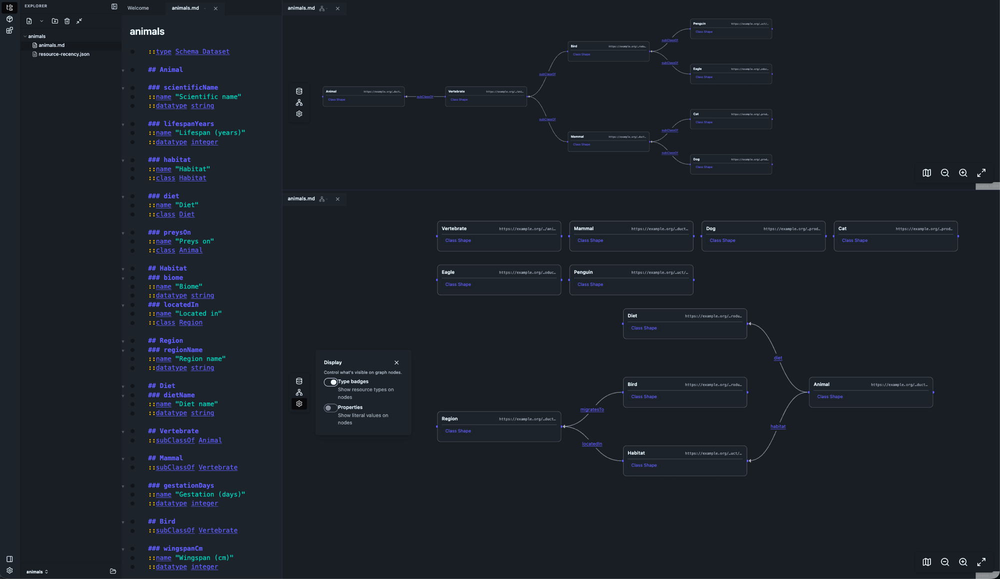

# Folio

Folio is a desktop note-taking app that turns your Markdown into queryable
knowledge. Write plain notes; Folio extracts the semantic structure (RDF) in
the background — no database to run, no schema to define up front.

## Download

**[Download the latest release →](https://github.com/SemviaIO/Folio/releases/latest)**

Open the downloaded `.dmg` and drag **Folio** to your Applications folder.
Builds are **macOS (Apple Silicon)** only for now, and the app keeps itself
up to date automatically once installed.

## Issues & feedback

Found a bug or want a feature?
**[Open an issue →](https://github.com/SemviaIO/Folio/issues/new/choose)**

---

Built by [Semvia](https://github.com/SemviaIO). This repository hosts release
downloads only — the source lives in a private monorepo.
